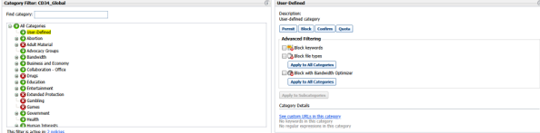
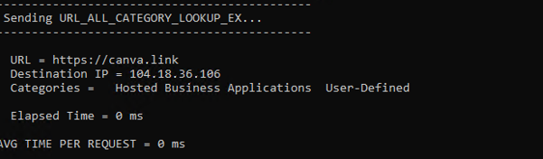
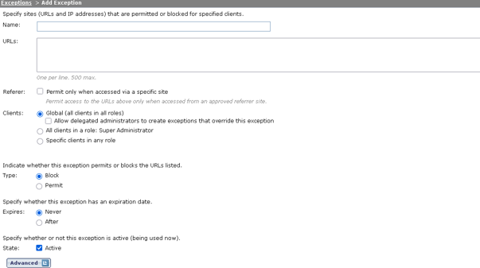

Forcepoint Autorisé une url :  

Web > Policy Management > Edit Categories > User-defined > Recategorized URLs  

→ Add URLs → ok → Save and Deploy  

Verifier dans Policies -> Edit Policy que la categorie soit presente en vert (Permit)  

On peux verifier que l’adresse soit bien presente : See custom URLs in this category  

Pour tester un lien de manière plus fiable que par la webui :  
Webui  

Via SRV09  

E:\Program Files (x86)\Websense\Web Security\bin> .\WebsensePing.exe -url https://canva.link -m 25 -user local\psimon -uip 10.20.11.14  
 

Avec comme option :  
Usage: E:\Program Files (x86)\Websense\Web Security\bin\WebsensePing.exe  
                   [-s hostname/ip]  [-p port number] [-m message type]  
                   [-t timeout-secs] [-n number messages] [-url URL]  
                   [-user user path] [-uip user ip] [-d ip]  
                   [-h help] [-defaults show defaults]  
                   [-more more data fields and message types]  

Message Types: [most used types, use -more for others]  
                    6  - SERVER_STATUS_REQUEST_EX (4.3.0+)  
                    18 - DYNAMIC_HTTP_LOOKUP_V6_REQUEST (7.7+)  
                    19 - DYNAMIC_HTTP_LOOKUP_V6_REQUEST_EX (7.7+ Hybrid Only)  
                    20 - DYNAMIC_LOG_REQUEST_V6_EX (7.7+)  
                    21 - PROTOCOL_LOOKUP_V6_REQUEST (7.7+)  
                    22 - URL_CATEGORY_LOOKUP_V6_EX_REQUEST (7.7+)  
                    23 - DYNAMIC_HTTP_LOOKUP_V6_REQUEST_EX2 (7.9+ Hybrid Only)  
                    24 - SET_CATEGORY_INFO (7.9+ Hybrid Only) - Requires catInfoFile  
                    25 - URL_ALL_CATEGORY_LOOKUP_EX_REQUEST (8.0+)  
                    26 - SANDBOX_LOG_REQUEST (8.1+)  
                    27 - DYNAMIC_HTTP_LOOKUP_V8_REQUEST (8.4+)  

Il faut egalement créer une exeption  
 

Bypass PAC file  

Et si çà ne passe toujours pas, modifier le fichier proxy.pac  

// Bypass Forcepoint pour canva.link  
if (shExpMatch(host, "canva.link") ||   
    shExpMatch(host, "*.canva.link") ||  
    shExpMatch(host, "canva.com") ||  
    shExpMatch(host, "*.canva.com")) {  
    return "DIRECT";  
}  
