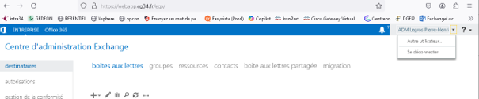
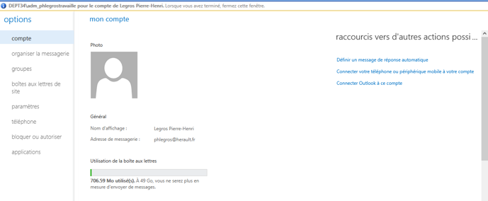
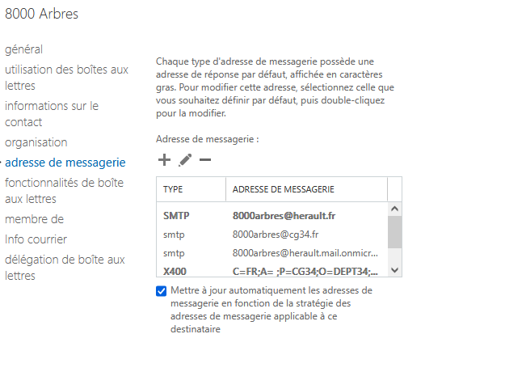
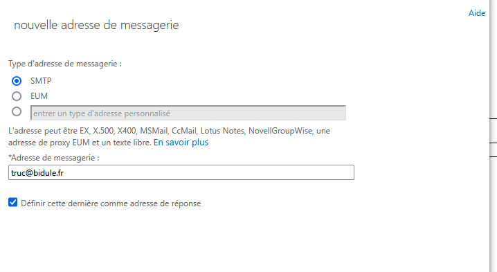

Pour mettre en place un Message d’absence outlook et autre options de  compte  

Cliquer sur autre utlisateur  
 
Modifier l’alias de messagerie  
 
Décocher Mettre a jours….  
 
Faire + et ajouté le nouvel alias  
 
Cocher definir cette adresse …  
