messagerie, SharePoint et dossier publique exchange.  

RDV dans le centre de conformité « PUREVIEW »  

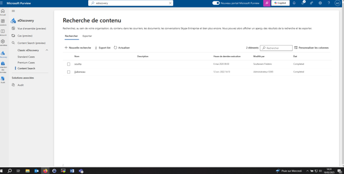  

Ajouté une recherche :  
Lui donner un nom et une description 

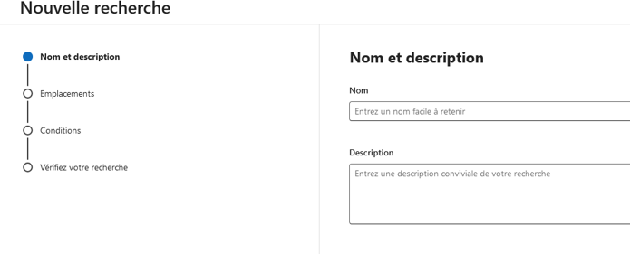   

Sélectionner le type de service à rechercher :  

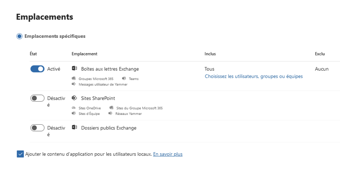  

Dans la colonne Inclus, cliquer sur le lien en bleu « Choisir les utilisateurs »  

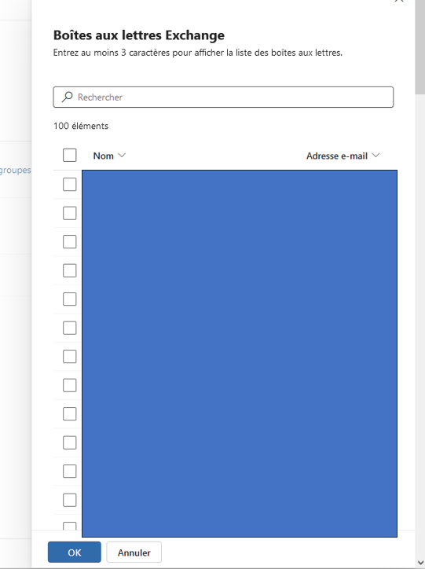  

Suivant suivant suivant et  

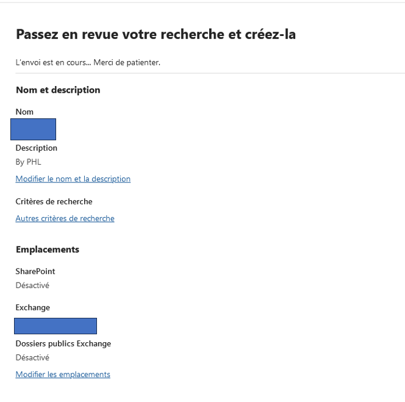  

Puis  

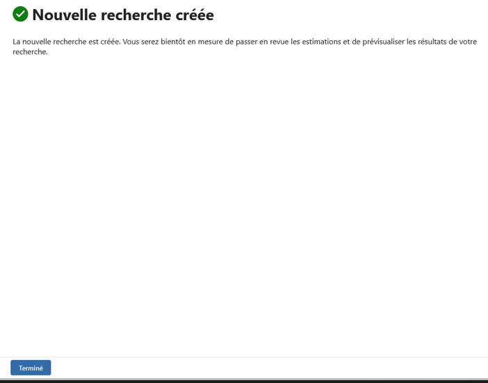  

Une fois la recherche complète vous aurez ceci :  

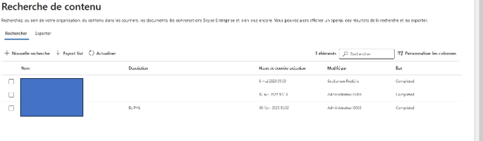  

Cliquer sur le Nom afin d’afficher le volet laterale droit.  

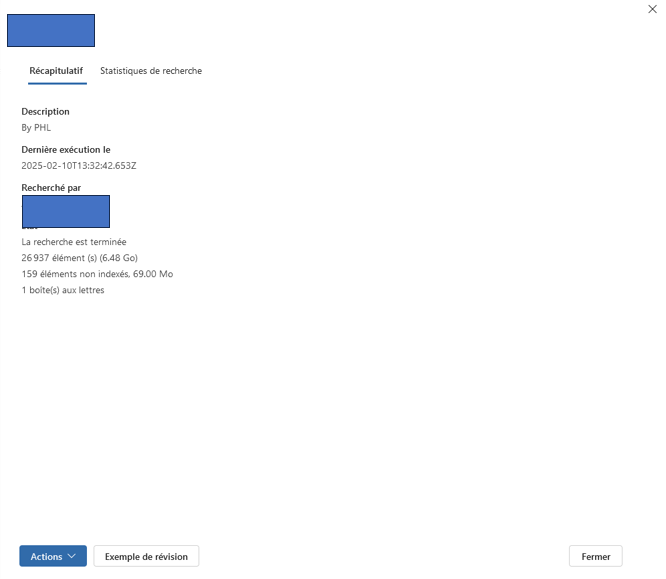  
Sur Actions il sera possible d’exporter vers un pst  

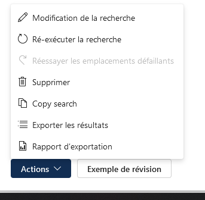  

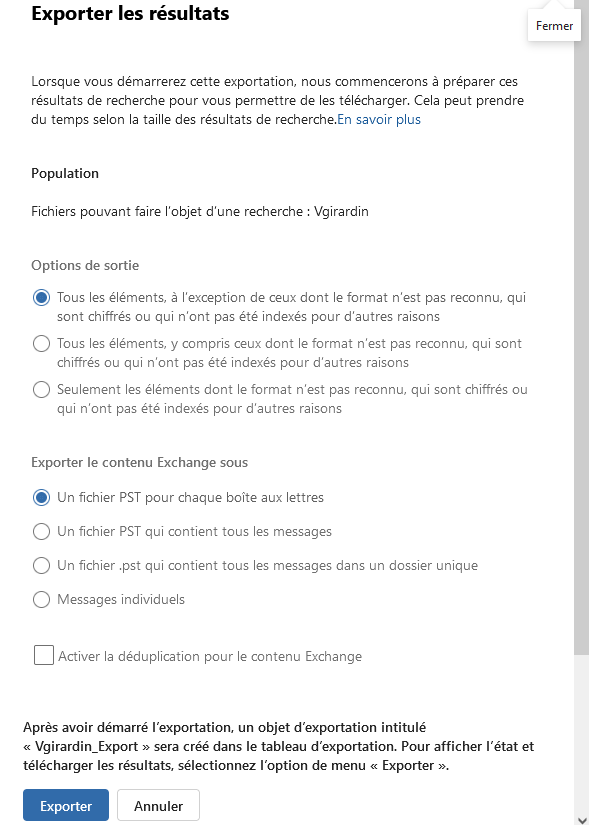  

La déduplication des données est un processus utilisé pour réduire la quantité de données stockées en éliminant les copies redondantes  

Une fois l’export créé, il sera possible de le télécharger. ATTENTION ne fonctionne qu’avec edge ou ie (sinon vous aurez une jolie erreur !)  

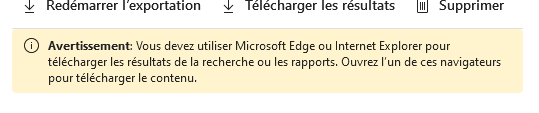  

Juste avant de DL, il sera demandé la clé du style :  
« ?sv=XXXX&sr=c&si=[REDACTED]&sig=[REDACTED] »  

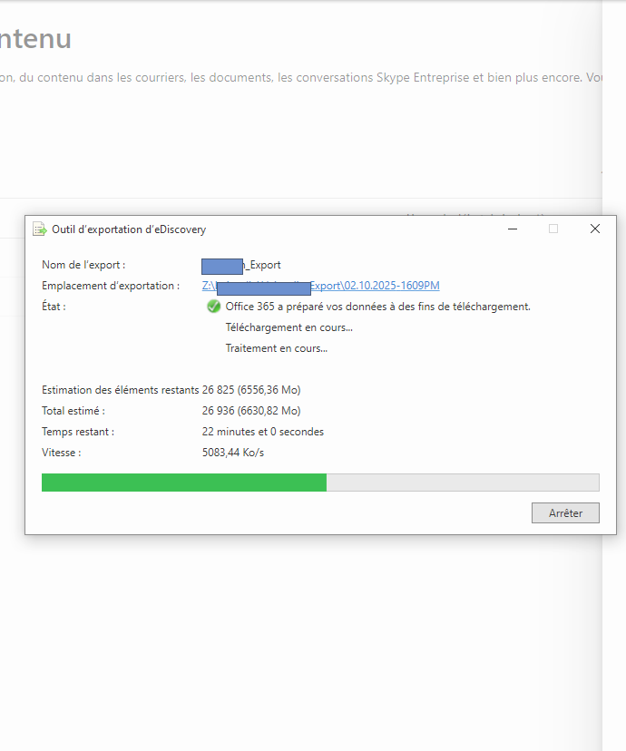  
