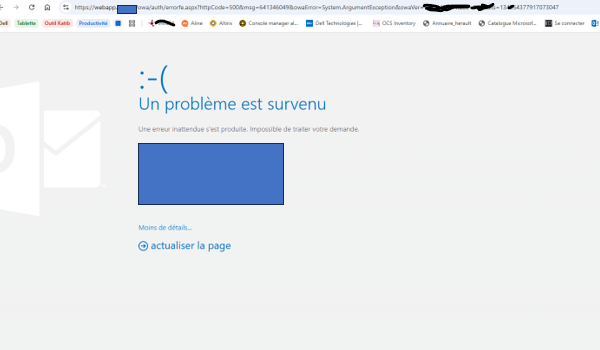

  
  
## Connaitre la base de la boîte  
Get-Mailbox -Identity "mdurand@local.fr" | Format-List Database  

---------------------------------------------------------------------------------

# 🟥 Exporter, désactiver, réactiver, importer

## 1. Export PST  
New-MailboxExportRequest -Mailbox "nlefevre" -FilePath "\\SRV04\pst\nlefevre.pst" -Priority High  

### Voir toutes les requêtes d’export en cours  
Get-MailboxExportRequest | Get-MailboxExportRequestStatistics  

### Si ça coince  
#### Automatique et plus efficace  
Get-MailboxImportRequest | Where-Object {$_.Status -eq "Queued"} | Remove-MailboxImportRequest -Confirm:$false  

#### Moins efficace  
Remove-MailboxExportRequest -Identity "cbabikian\MailboxExport"  

## 2. Désactiver la BAL  
Disable-Mailbox -Identity "walbert2"  

## 3. Réactiver la BAL  
Enable-Mailbox -Identity "walbert2"  

## 4. Import PST  
New-MailboxImportRequest -Mailbox "walbert2" -FilePath "\\SRV04\pst\walbert2.pst" -Priority High  

### Voir toutes les requêtes d’import en cours  
Get-MailboxImportRequest | Get-MailboxImportRequestStatistics  

### Si ça coince  
#### Automatique et plus efficace  
Get-MailboxImportRequest | Where-Object {$_.Status -eq "Queued"} | Remove-MailboxImportRequest -Confirm:$false  

#### Stopper un import  
Remove-MailboxExportRequest -Identity "cbabikian\MailboxImport"  

## Suivi d’une importation  
Get-MailboxImportRequest -Mailbox "cmartin"  
Get-MailboxImportRequestStatistics -Identity "cmartin\MailboxImport"  

Update-Recipient -Identity mdurand@local.fr  

---------------------------------------------------------------------------------

# 🟥 Réintégration d’un MailUser → Mailbox

## Vérifier l’état du mailuser  
Get-Recipient -Identity "cbernard@local.fr" | Format-List Name,RecipientType,ExternalEmailAddress,ExchangeGuid  

## Nettoyer l’objet AD  
Set-ADUser -Identity "cbernard" -Clear proxyAddresses, mail, targetAddress, msExchMailboxGuid, msExchHomeServerName, msExchRecipientTypeDetails  

## Réactiver la BAL  
Enable-Mailbox -Identity "cbernard" -Database "BD9999"  

---------------------------------------------------------------------------------

# 🟥 Faire l’inverse : Mailbox → RemoteMailbox

## Vérifier l’état  
Get-Recipient -Identity "vrousseau" | fl Name,RecipientTypeDetails,PrimarySmtpAddress  

## Désactiver la BAL locale  
Disable-MailUser -Identity "vrousseau"  

## Activer la BAL distante (O365)  
Enable-RemoteMailbox -Identity "vrousseau" -RemoteRoutingAddress vrousseau@local.mail.onmicrosoft.com  
