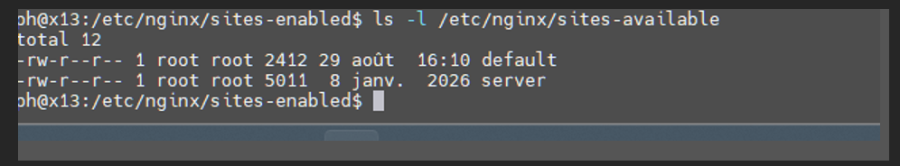
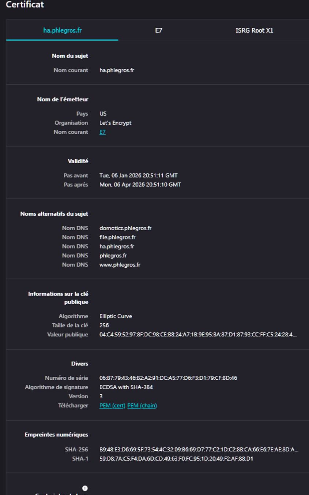
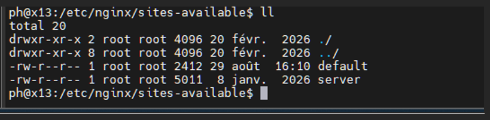

<p align="center">
  
</p>

# 

# 

# 

# 

# Guide Nginx — Reverse Proxy sécurisé sur Debian \& RHEL

> Par \\\*\\\*Pierre-Henri Legros\\\*\\\* — 06/03/2026

Vue d'ensemble complète et opérationnelle de la configuration d'un serveur Nginx moderne sur **Debian** et **RHEL**.

> Les exemples utilisés dans ce document (Home Assistant, Domoticz, ESPHome, FileBrowser) servent uniquement d'illustration pour démontrer la mise en place d'un reverse proxy multi-services. Les principes présentés sont applicables à n'importe quelle application web interne ou externe.

## Objectifs

* Déployer un reverse proxy performant et sécurisé
* Héberger plusieurs services via des sous-domaines
* Gérer le HTTPS via Let's Encrypt ou certificats clients
* Comprendre les différences entre Debian et RHEL pour adapter les configurations

## Contenu clé

* Installation et architecture Nginx
* Configuration de sites statiques et dynamiques
* Reverse proxy pour Home Assistant, Domoticz, FileBrowser, ESPHome
* Sécurisation HTTPS (headers, HSTS, CSP, rate limiting)
* Supervision et logs
* Dépannage et bonnes pratiques
* Optimisation des performances
* Comparatif Debian vs RHEL (structure, SELinux, AppStream, firewall)

## Valeur ajoutée

* Configurations prêtes à l'emploi
* Approche pédagogique et reproductible
* Adapté aux environnements personnels et professionnels
* Intègre les standards de sécurité modernes

\---

## Table des matières

* [Introduction](#introduction)
* [Architecture](#architecture)
* [Installations](#installations)

  * [Installation sur Debian](#installation-sur-debian)
  * [Installation sur RHEL 8/9](#installation-sur-rhel-89)
* [Structure Nginx : Debian vs RHEL](#structure-nginx--debian-vs-rhel)
* [Configuration complète Nginx sur Debian 13](#configuration-complète-nginx-sur-debian-13)
* [Configuration avec certificat client](#configuration-avec-certificat-client)
* [Bonnes pratiques Nginx](#bonnes-pratiques-nginx)
* [Dépannage](#dépannage)
* [Performance](#performance)

\---

## Introduction

Ce document a pour objectif de fournir une référence technique complète et opérationnelle pour l'installation, la configuration et la sécurisation d'un serveur Nginx sur Debian et RHEL 8/9. Il s'adresse aux administrateurs systèmes, ingénieurs DevOps, intégrateurs, et toute personne souhaitant mettre en place un reverse proxy performant, sécurisé et maintenable, que ce soit dans un environnement personnel, professionnel ou hybride.

L'approche retenue est volontairement pragmatique : chaque section présente des exemples concrets, reproductibles, validés en production, et accompagnés de bonnes pratiques issues du terrain. Le document couvre l'ensemble du cycle de mise en place d'un serveur Nginx moderne : installation, architecture, configuration de sites statiques et dynamiques, reverse proxy, gestion TLS (Let's Encrypt ou certificats clients), sécurité, supervision, dépannage et optimisation des performances.

Enfin, une comparaison détaillée entre Debian et RHEL permet de comprendre les différences structurelles entre ces deux familles de distributions, afin d'adapter efficacement les configurations selon le contexte d'exploitation.

## Architecture

```
Internet → Nginx (Debian) → Home Assistant (http://localhost:8123)
                           ↳ Site statique (/var/www/site)
```

## Installations

### Installation sur Debian

```bash
sudo apt update
sudo apt install nginx -y
sudo systemctl enable --now nginx
sudo systemctl status nginx
```

**Arborescence**

```
/etc/nginx/
├── nginx.conf
├── sites-available/
└── sites-enabled/
```

```bash
ls -l /etc/nginx/sites-available  

 

  
```

#### Configuration basique d'un site web statique (port 80)

```nginx
server {
    listen 80;
    server\\\_name monsite.fr;
    root /var/www/site;
    index index.html;

    access\\\_log /var/log/nginx/site\\\_access.log;
    error\\\_log  /var/log/nginx/site\\\_error.log;

    location / {
        try\\\_files $uri $uri/ =404;
    }
}
```

**Pour mettre en place :**

```bash
sudo mkdir -p /var/www/site
sudo vim /var/www/site/index.html
sudo ln -s /etc/nginx/sites-available/site /etc/nginx/sites-enabled/

!\[NginX](images/Nginx2.png)  
sudo nginx -t
sudo systemctl reload nginx
```

**HTTPS avec certbot (configuration automatique)**

```bash
sudo apt install certbot python3-certbot-nginx -y
sudo certbot --nginx -d ha.phlegros.fr
```

Pour renouveler le certificat :

```bash
sudo certbot renew --dry-run
```

> Certbot ajoute automatiquement le bloc HTTPS au fichier de configuration de Nginx.






#### Sécurisation HTTPS (Debian)

À ajouter dans chaque bloc `server` entre `{}` :

```nginx
add\\\_header X-Frame-Options "SAMEORIGIN";
add\\\_header X-Content-Type-Options "nosniff";
add\\\_header X-XSS-Protection "1; mode=block";
add\\\_header Referrer-Policy "strict-origin-when-cross-origin";
add\\\_header Strict-Transport-Security "max-age=31536000; includeSubDomains" always;
add\\\_header Content-Security-Policy "default-src 'self';" always;
```

**Rate limiting :**

```nginx
limit\\\_req\\\_zone $binary\\\_remote\\\_addr zone=one:10m rate=5r/s;

location / {
    limit\\\_req zone=one burst=10 nodelay;
    proxy\\\_pass http://127.0.0.1:8123;
}
```

#### Logs et supervision

```bash
tail -f /var/log/nginx/access.log
tail -f /var/log/nginx/error.log
journalctl -u nginx -f
```

Capture d'écran utile :

* Logs en temps réel
* `htop` montrant Nginx + Home Assistant

#### Répertoires et fichiers importants

|Chemin|Rôle|
|-|-|
|`/etc/nginx/nginx.conf`|Fichier de configuration principal|
|`/etc/nginx/conf.d/`|Fichiers de configuration additionnels (`\\\*.conf`)|
|`/etc/nginx/sites-available/`|Vhosts disponibles|
|`/etc/nginx/sites-enabled/`|Vhosts activés (symlinks vers `sites-available`)|
|`/etc/nginx/snippets/`|Petits blocs de config réutilisables|
|`/usr/share/nginx/`|Fichiers fournis par le paquet (ex. `mime.types`)|
|`/var/log/nginx/`|Logs d'erreur et d'accès|
|`/var/www/`|Racine web par défaut (selon le paquet Debian)|

#### Annexes utiles

* **Commandes de dépannage**

  * `nginx -t`
  * `systemctl restart nginx`
* **Vérification des ports**

  * `ss -tulpn | grep nginx`
* Vérification du firewall UFW si activé

### Installation sur RHEL 8/9

```bash
sudo dnf install -y nginx        # installation du paquet
nginx -v                         # vérifier la version
sudo systemctl enable --now nginx  # active le service au démarrage et le lance maintenant
sudo systemctl status nginx
```

#### Ouverture des ports dans le firewall, exemple générique :

```bash
sudo firewall-cmd --permanent --add-service=http
sudo firewall-cmd --permanent --add-service=https
sudo firewall-cmd --reload
```

#### Emplacement des fichiers important

|Chemin|Rôle|
|-|-|
|`/etc/nginx/nginx.conf`|Configuration principale|
|`/etc/nginx/conf.d/`|Vhosts / server blocks|
|`/usr/share/nginx/html/`|Racine web par défaut|
|`/var/log/nginx/`|Logs|

> Ces emplacements sont les mêmes sur RHEL 8 et RHEL 9.

#### Sécurisation HTTPS (RHEL)

```nginx
# Sécurité HTTP
add\\\_header X-Frame-Options "SAMEORIGIN";
add\\\_header X-Content-Type-Options "nosniff";
add\\\_header Referrer-Policy "strict-origin-when-cross-origin";
add\\\_header X-XSS-Protection "1; mode=block";
add\\\_header Strict-Transport-Security "max-age=31536000; includeSubDomains" always;
add\\\_header Content-Security-Policy "default-src 'self';" always;
```

#### Différences notoires entre RHEL 8 \& 9

* **Modules AppStream**

  * RHEL 8 : flux 1.14 et 1.16
  * RHEL 9 : flux 1.20, 1.22
* **Gestion du système et du réseau**

  * Suppression des `network-scripts`, utilisation obligatoire de NetworkManager (pas d'impact direct pour Nginx, mais peut influencer la configuration réseau : IP, interfaces, firewall)
* **SELinux**

  * RHEL 9 ne permet plus de désactiver SELinux via `SELINUX=disabled` dans `/etc/selinux/config`. Il faut corriger les contextes plutôt que de désactiver :

&#x20;   `bash sudo semanage port -a -t http\\\_port\\\_t -p tcp 8123 # ou sudo restorecon -Rv /etc/nginx sudo setsebool -P httpd\\\_can\\\_network\\\_connect 1 `

* **Versions de base du système**

  * RHEL 9 utilise un kernel 5.14 contre 4.18 pour RHEL 8. Cela améliore les performances réseau et la gestion des connexions, ce qui peut bénéficier à Nginx.

#### Synthèse des différences

|Élément|RHEL 8|RHEL 9|Impact pour Nginx|
|-|-|-|-|
|AppStream|Versions plus anciennes|Versions plus récentes|Choix de versions plus modernes|
|SELinux|Désactivation possible|Désactivation supprimée|Nécessite de gérer les contextes|
|Network scripts|Encore présents (dépréciés)|Supprimés|Configuration réseau modernisée|
|Kernel|4.18|5.14|—|

## Structure Nginx : Debian vs RHEL

### Debian — organisation modulaire

Debian utilise une structure inspirée d'Apache, pensée pour gérer plusieurs vhosts proprement.

* `/etc/nginx/nginx.conf` — configuration principale
* `/etc/nginx/conf.d/` — configurations globales (`\\\*.conf`)
* `/etc/nginx/sites-available/` — vhosts disponibles
* `/etc/nginx/sites-enabled/` — vhosts activés (symlinks vers `sites-available`)
* `/etc/nginx/snippets/` — blocs réutilisables
* `/usr/share/nginx/` — fichiers fournis par le paquet (`mime.types`, `fastcgi\\\_params`…)
* `/var/log/nginx/` — logs
* `/var/www/` — racine web par défaut (souvent `/var/www/html`)

> \\\*\\\*Particularité Debian :\\\*\\\* les vhosts \\\*ne doivent pas\\\* être placés dans `conf.d/` mais dans `sites-available/`.

### RHEL 8/9 — organisation plus simple

RHEL utilise une structure plus compacte, adaptée aux installations « serveur unique ».

* `/etc/nginx/nginx.conf` — configuration principale
* `/etc/nginx/conf.d/` — vhosts / server blocks
* `/usr/share/nginx/html/` — racine web par défaut
* `/var/log/nginx/` — logs

> \\\*\\\*Particularité RHEL :\\\*\\\* il n'y a pas de `sites-available` / `sites-enabled`. Tous les vhosts sont dans `conf.d/`.

### Synthèse claire des différences

|Élément|Debian|RHEL 8/9|Impact|
|-|-|-|-|
|Organisation des vhosts|`sites-available` / `sites-enabled`|`conf.d` uniquement|Debian = plus propre pour multi-sites|
|Racine web par défaut|`/var/www/html`|`/usr/share/nginx/html`|Différence à noter dans les tutos|
|Modules|Version Debian stable|AppStream (1.14 → 1.22 selon RHEL)|Versions plus récentes sur RHEL 9|
|SELinux|Non activé par défaut|Activé et strict|Peut bloquer Nginx si contextes incorrects|
|Firewall|iptables/nftables|firewalld|Commandes différentes|
|Kernel|Debian 12/13 = 6.x|RHEL 8 = 4.18 / RHEL 9 = 5.14|RHEL 9 = meilleures perfs réseau|

## Configuration complète Nginx sur Debian 13

### `/etc/nginx/nginx.conf`

```nginx
user www-data;
worker\\\_processes auto;
pid /run/nginx.pid;
error\\\_log /var/log/nginx/error.log;
include /etc/nginx/modules-enabled/\\\*.conf;

events {
    worker\\\_connections 768;
    multi\\\_accept on;
}

http {
    ##
    # Basic Settings
    ##
    sendfile on;
    tcp\\\_nopush on;
    types\\\_hash\\\_max\\\_size 2048;
    server\\\_tokens off; # Recommended practice is to turn this off
    keepalive\\\_timeout 65;
    # server\\\_names\\\_hash\\\_bucket\\\_size 64;
    # server\\\_name\\\_in\\\_redirect off;

    include /etc/nginx/mime.types;
    default\\\_type application/octet-stream;

    ##
    # SSL Settings
    ##
    ssl\\\_protocols TLSv1.2 TLSv1.3; # Dropping SSLv3 (POODLE), TLS 1.0, 1.1
    ssl\\\_prefer\\\_server\\\_ciphers off; # Don't force server cipher order.

    ##
    # Logging Settings
    ##
    access\\\_log /var/log/nginx/access.log;

    ##
    # Gzip Settings
    ##
    gzip on;
    # gzip\\\_vary on;
    # gzip\\\_proxied any;
    # gzip\\\_comp\\\_level 6;
    # gzip\\\_buffers 16 8k;
    # gzip\\\_http\\\_version 1.1;
    # gzip\\\_types text/plain text/css application/json application/javascript text/xml application/xml application/xml+rss text/javascript;

    ##
    # Virtual Host Configs
    ##
    include /etc/nginx/conf.d/\\\*.conf;
    include /etc/nginx/sites-enabled/\\\*;
}

# mail {
#   # See sample authentication script at:
#   # http://wiki.nginx.org/ImapAuthenticateWithApachePhpScript
#
#   # auth\\\_http localhost/auth.php;
#   # pop3\\\_capabilities "TOP" "USER";
#   # imap\\\_capabilities "IMAP4rev1" "UIDPLUS";
#
#   server {
#       listen localhost:110;
#       protocol pop3;
#       proxy on;
#   }
#
#   server {
#       listen localhost:143;
#       protocol imap;
#       proxy on;
#   }
# }
```

### `/etc/nginx/sites-available/server`  


Le fichier `default` n'est pas utilisé. Pour activer le fichier de server, le lier dans `/etc/nginx/sites-enabled` :

```bash
sudo ln -s /etc/nginx/sites-available/server /etc/nginx/sites-enabled/
```

#### Exemple de fichier de conf avec 4 sites

```nginx
# ------------------------------
# Domoticz
# ------------------------------
server {
    server\\\_name domoticz.phlegros.fr;

    location / {
        proxy\\\_pass http://192.168.0.200:8080;
        proxy\\\_set\\\_header Host $host;
        proxy\\\_set\\\_header X-Real-IP $remote\\\_addr;
    }

    listen 443 ssl; # managed by Certbot
    ssl\\\_certificate /etc/letsencrypt/live/phlegros.fr/fullchain.pem; # managed by Certbot
    ssl\\\_certificate\\\_key /etc/letsencrypt/live/phlegros.fr/privkey.pem; # managed by Certbot
    include /etc/letsencrypt/options-ssl-nginx.conf; # managed by Certbot
    ssl\\\_dhparam /etc/letsencrypt/ssl-dhparams.pem; # managed by Certbot

    # Sécurité HTTP
    add\\\_header X-Frame-Options "SAMEORIGIN";
    add\\\_header X-Content-Type-Options "nosniff";
    add\\\_header Referrer-Policy "strict-origin-when-cross-origin";
    add\\\_header X-XSS-Protection "1; mode=block";
    add\\\_header Strict-Transport-Security "max-age=31536000; includeSubDomains" always;
    server\\\_tokens off;
}

# ------------------------------
# Home Assistant
# ------------------------------
server {
    server\\\_name ha.phlegros.fr;

    location / {
        proxy\\\_pass http://192.168.0.200:8123;
        proxy\\\_set\\\_header Host $host;
        proxy\\\_set\\\_header X-Real-IP $remote\\\_addr;
        proxy\\\_set\\\_header X-Forwarded-For $proxy\\\_add\\\_x\\\_forwarded\\\_for;
        proxy\\\_set\\\_header X-Forwarded-Proto $scheme;
        proxy\\\_set\\\_header Upgrade $http\\\_upgrade;
        proxy\\\_set\\\_header Connection "upgrade";
        proxy\\\_http\\\_version 1.1;
    }

    listen 443 ssl; # managed by Certbot
    ssl\\\_certificate /etc/letsencrypt/live/phlegros.fr/fullchain.pem; # managed by Certbot
    ssl\\\_certificate\\\_key /etc/letsencrypt/live/phlegros.fr/privkey.pem; # managed by Certbot
    include /etc/letsencrypt/options-ssl-nginx.conf; # managed by Certbot
    ssl\\\_dhparam /etc/letsencrypt/ssl-dhparams.pem; # managed by Certbot

    # Sécurité HTTP
    add\\\_header X-Frame-Options "SAMEORIGIN";
    add\\\_header X-Content-Type-Options "nosniff";
    add\\\_header Referrer-Policy "strict-origin-when-cross-origin";
    add\\\_header X-XSS-Protection "1; mode=block";
    add\\\_header Strict-Transport-Security "max-age=31536000; includeSubDomains" always;
    server\\\_tokens off;
}

# ------------------------------
# FileBrowser
# ------------------------------
server {
    server\\\_name file.phlegros.fr;

    location / {
        proxy\\\_pass http://192.168.0.200:8888;
        proxy\\\_set\\\_header Host $host;
        proxy\\\_set\\\_header X-Real-IP $remote\\\_addr;
        proxy\\\_set\\\_header X-Forwarded-For $proxy\\\_add\\\_x\\\_forwarded\\\_for;
        proxy\\\_set\\\_header X-Forwarded-Proto $scheme;

        client\\\_max\\\_body\\\_size 5G;
        proxy\\\_request\\\_buffering off;
        proxy\\\_buffering off;
        proxy\\\_connect\\\_timeout 600s;
        proxy\\\_send\\\_timeout 600s;
        proxy\\\_read\\\_timeout 600s;
        send\\\_timeout 600s;

        access\\\_log /var/log/nginx/filebrowser\\\_access.log combined buffer=16k flush=1m;
    }

    listen 443 ssl; # managed by Certbot
    ssl\\\_certificate /etc/letsencrypt/live/phlegros.fr/fullchain.pem; # managed by Certbot
    ssl\\\_certificate\\\_key /etc/letsencrypt/live/phlegros.fr/privkey.pem; # managed by Certbot
    include /etc/letsencrypt/options-ssl-nginx.conf; # managed by Certbot
    ssl\\\_dhparam /etc/letsencrypt/ssl-dhparams.pem; # managed by Certbot

    # Sécurité HTTP
    add\\\_header X-Frame-Options "SAMEORIGIN";
    add\\\_header X-Content-Type-Options "nosniff";
    add\\\_header Referrer-Policy "strict-origin-when-cross-origin";
    add\\\_header X-XSS-Protection "1; mode=block";
    add\\\_header Strict-Transport-Security "max-age=31536000; includeSubDomains" always;
    server\\\_tokens off;
}

# ------------------------------
# ESPHome
# ------------------------------
server {
    server\\\_name esphome.phlegros.fr;

    location / {
        proxy\\\_pass http://192.168.0.200:6052;
        proxy\\\_set\\\_header Host $host;
        proxy\\\_set\\\_header X-Real-IP $remote\\\_addr;
        proxy\\\_set\\\_header X-Forwarded-For $proxy\\\_add\\\_x\\\_forwarded\\\_for;
        proxy\\\_set\\\_header X-Forwarded-Proto $scheme;
        proxy\\\_http\\\_version 1.1;
        proxy\\\_buffering off;
        proxy\\\_request\\\_buffering off;
    }

    listen 443 ssl; # managed by Certbot
    ssl\\\_certificate /etc/letsencrypt/live/esphome.phlegros.fr/fullchain.pem; # managed by Certbot
    ssl\\\_certificate\\\_key /etc/letsencrypt/live/esphome.phlegros.fr/privkey.pem; # managed by Certbot
    include /etc/letsencrypt/options-ssl-nginx.conf; # managed by Certbot
    ssl\\\_dhparam /etc/letsencrypt/ssl-dhparams.pem; # managed by Certbot

    # Sécurité HTTP
    add\\\_header X-Frame-Options "SAMEORIGIN";
    add\\\_header X-Content-Type-Options "nosniff";
    add\\\_header Referrer-Policy "strict-origin-when-cross-origin";
    add\\\_header X-XSS-Protection "1; mode=block";
    add\\\_header Strict-Transport-Security "max-age=31536000; includeSubDomains" always;
    server\\\_tokens off;
}

# ------------------------------
# Site principal
# ------------------------------
server {
    server\\\_name phlegros.fr www.phlegros.fr;
    root /var/www/phlegros.fr/html;
    index index.html;

    location / {
        try\\\_files $uri $uri/ =404;
    }

    listen 443 ssl; # managed by Certbot
    ssl\\\_certificate /etc/letsencrypt/live/phlegros.fr/fullchain.pem; # managed by Certbot
    ssl\\\_certificate\\\_key /etc/letsencrypt/live/phlegros.fr/privkey.pem; # managed by Certbot
    include /etc/letsencrypt/options-ssl-nginx.conf; # managed by Certbot
    ssl\\\_dhparam /etc/letsencrypt/ssl-dhparams.pem; # managed by Certbot

    # Sécurité HTTP
    add\\\_header X-Frame-Options "SAMEORIGIN";
    add\\\_header X-Content-Type-Options "nosniff";
    add\\\_header Referrer-Policy "strict-origin-when-cross-origin";
    add\\\_header X-XSS-Protection "1; mode=block";
    add\\\_header Strict-Transport-Security "max-age=31536000; includeSubDomains" always;
    server\\\_tokens off;
}

# ------------------------------
# Redirections HTTP → HTTPS (générées par Certbot)
# ------------------------------
server {
    if ($host = ha.phlegros.fr) {
        return 301 https://$host$request\\\_uri;
    } # managed by Certbot

    listen 80;
    server\\\_name ha.phlegros.fr;
    return 404; # managed by Certbot
}

server {
    if ($host = domoticz.phlegros.fr) {
        return 301 https://$host$request\\\_uri;
    } # managed by Certbot

    listen 80;
    server\\\_name domoticz.phlegros.fr;
    return 404; # managed by Certbot
}

server {
    if ($host = file.phlegros.fr) {
        return 301 https://$host$request\\\_uri;
    } # managed by Certbot

    listen 80;
    server\\\_name file.phlegros.fr;
    return 404; # managed by Certbot
}

server {
    if ($host = www.phlegros.fr) {
        return 301 https://$host$request\\\_uri;
    } # managed by Certbot

    if ($host = phlegros.fr) {
        return 301 https://$host$request\\\_uri;
    } # managed by Certbot

    listen 80;
    server\\\_name phlegros.fr www.phlegros.fr;
    return 404; # managed by Certbot
}
```

## Configuration avec certificat client

### Destinations typiques

|OS|Emplacement|
|-|-|
|Debian|`/etc/nginx/ssl/nomdomaine/`|
|RHEL|`/etc/pki/tls/private` ou `/etc/pki/tls/certs`|

### Exemple de configuration

```nginx
server {
    server\\\_name ha.phlegros.fr;

    location / {
        proxy\\\_pass http://192.168.0.200:8123;
        proxy\\\_set\\\_header Host $host;
        proxy\\\_set\\\_header X-Real-IP $remote\\\_addr;
        proxy\\\_set\\\_header X-Forwarded-For $proxy\\\_add\\\_x\\\_forwarded\\\_for;
        proxy\\\_set\\\_header X-Forwarded-Proto $scheme;
        proxy\\\_set\\\_header Upgrade $http\\\_upgrade;
        proxy\\\_set\\\_header Connection "upgrade";
        proxy\\\_http\\\_version 1.1;
    }

    listen 443 ssl;
    ssl\\\_certificate /etc/nginx/ssl/phlegros.fr/phlegros.crt;       # Sur RHEL: /etc/pki/tls/certs/phlegros.crt
    ssl\\\_certificate\\\_key /etc/nginx/ssl/phlegros.fr/phlegros.key;   # Sur RHEL: /etc/pki/tls/private/phlegros.key
    ssl\\\_trusted\\\_certificate /etc/nginx/ssl/phlegros.fr/phlegros.chain; # Sur RHEL: /etc/pki/tls/certs/phlegros.chain

    # Certains fournisseurs livrent un fichier "bundle" contenant la chaîne complète.
    # Dans ce cas, utiliser ssl\\\_trusted\\\_certificate avec ce fichier.

    include /etc/nginx/options-ssl-nginx.conf;
    ssl\\\_dhparam /etc/nginx/ssl/dhparam.pem;
}
```

## Bonnes pratiques Nginx

* `server\\\_tokens off;`
* `ssl\\\_protocols TLSv1.2 TLSv1.3;`
* `proxy\\\_read\\\_timeout`
* `client\\\_max\\\_body\\\_size`
* `gzip on;`
* Séparation des logs par vhost
* `proxy\\\_set\\\_header Connection "";` — pour éviter les problèmes de WebSocket sur certains services

## Dépannage

```bash
curl -I https://ha.phlegros.fr
nginx -T                          # afficher toute la config
journalctl -xe
ss -tulpn | grep nginx
sudo nginx -s reload
sudo tail -f /var/log/nginx/\\\*error\\\*.log
```

## Performance

```nginx
worker\\\_processes auto;
worker\\\_connections 1024;
keepalive\\\_timeout 65;
sendfile on;
worker\\\_rlimit\\\_nofile 100000;
```

## Conclusion

La mise en place d'un serveur Nginx fiable et sécurisé repose sur une compréhension claire de son architecture, de ses mécanismes internes et des bonnes pratiques associées. À travers ce document, nous avons exploré l'ensemble des étapes nécessaires pour déployer un reverse proxy robuste, capable de gérer plusieurs services, d'assurer une terminaison TLS propre, et de s'intégrer aussi bien dans un environnement Debian que RHEL.

Les configurations proposées sont éprouvées, reproductibles et adaptées à des usages réels, qu'il s'agisse d'héberger des services domotiques (Home Assistant, Domoticz, ESPHome), des applications web ou des sites statiques. Les sections dédiées à la sécurité, au dépannage et à l'optimisation permettent d'aller au-delà de la simple installation pour tendre vers une exploitation professionnelle.

Ce guide constitue ainsi une base solide pour toute personne souhaitant maîtriser Nginx dans un contexte moderne, et peut servir de support de formation, de documentation interne ou de référence pour des projets futurs.

