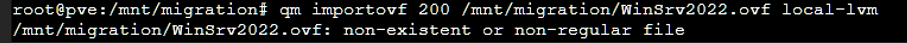

Vmware to proxmox

Pour la redha le system ne voulais pas booter, le pb était le bios uefi

1. Snapshot VMware avant migration
2. 2\. Noter l'ancienne MAC de chaque VM
3. installe VirtIO sur la vm
4. 3\. Migrer le disque (OVF / virt-v2v)
5. 4\. Créer la VM Proxmox avec la même MAC
6. 5\. Démarrer → la machine se reconnecte à l'AD
7. 6\. Vérifier : ping hostname, gpupdate /force

Avant la conversion renommé sans espace !

Uploader avec scp le .ovf .mf .vmdk et .nvram

scp 'D:\\VM\\ovf\\Windows_Server_2022\*' root@192.168.0.30:/var/lib/vz/template/iso/

qm importovf 200 /mnt/migration/WinSrv2022.ovf local-lvm

attention appres renommage

Il faut renommer les lignes 5&6 dans l'ovf

**1\. Vérifier la config de base**

bash

qm config 200

**2\. Configurer UEFI (firmware efi détecté dans l'OVF)**

bash

qm set 200 --bios ovmf

qm set 200 --efidisk0 local-lvm:0,efitype=4m,pre-enrolled-keys=1

**3\. Activer le disque importé**

bash

qm set 200 --scsi0 local-lvm:vm-200-disk-0

qm set 200 --boot order=scsi0

**4\. Ajouter le réseau**

bash

qm set 200 --net0 e1000,bridge=vmbr0

**5\. Monter l'ISO VirtIO**

bash

qm set 200 --ide2 local:iso/virtio-win.iso,media=cdrom

**6\. Démarrer**

bash

qm start 200

Une fois booter pour ctrl alt suppr :

qm sendkey 100 ctrl-alt-deleteete
