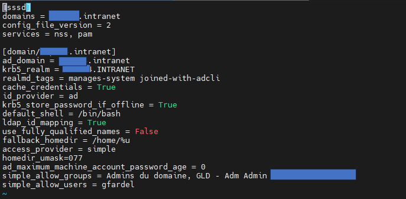

  

Et ajouté simple_allow_groups = xxxxx  
Ou simple_allow_users = xxxx  

Sur linux, quand ont a redemmarer tt les services et que la cos sh ou qu’un user a access denied.  

Verifier le status de realmd  
sudo systemctl status realmd  
sudo systemctl restart realmd  

