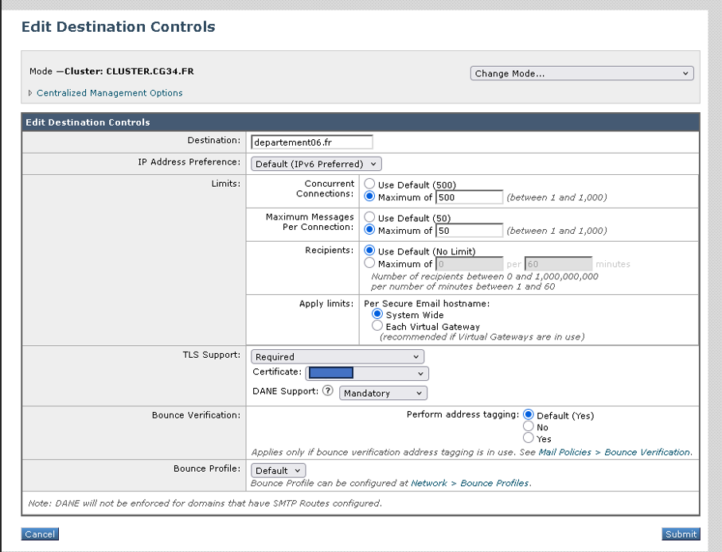
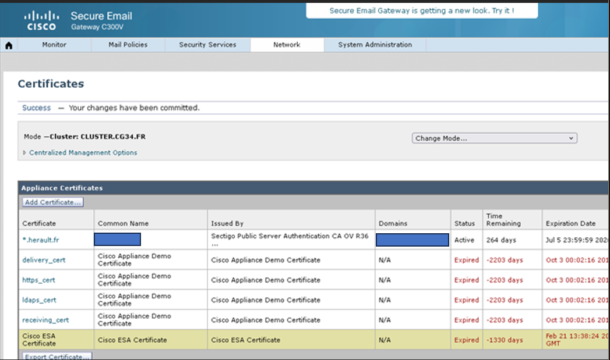

Ironport

Blaclister une adresse mail :

Mail policies incoming mail policies  blacklist  on ajoute une ligne et following Senders  
en entreprise recipients Any et remplir email adress

Pour bloquer une adresse ip :

Mail policiesHAT Hat Overview  Blocked List  Add senders : Mettre l’ip et un commentaire

Pour activer tls sur un nom de domaine précis :

Mail policiesHATDestination ControlsAdd destination :

  

•	Pour le certif Ironport  

Network> certificates> import 

openssl pkcs12 -export -out wildcard.local.fr.pfx -inkey wildcard.local.fr.decrypted.key -in cert.cer
Y mettre le mdp
Le cert.cert contiens le certificat du site.
Si çà ne passe pas, intégrer toute la chaine (cert racine, intermédiaire, ov…) jusqu’avoir un PFX de 14-16Ko, l’ajouté puis cliquer sur Download Certificate Signing Request... > Puis contacter la hotline cisco

Alors la Manip, j’ai supprimé l’actuel certif (*.local.fr) de la liste, puis téléchargé SectigoPublicServerAuthenticationCAOVR36.crt (https://sectigo.tbs-certificats.com/SectigoPublicServerAuthenticationRootR46.crt)

Puis avec openssl : 

[root@SRV13 wild]# openssl pkcs12 -export \
>   -inkey local.local.fr.decrypted.key \
>   -in __local_fr_cert.cer \
>   -certfile SectigoPublicServerAuthenticationCAOVR36.crt \
>   -out certificat_final.p12 \
>   -name "*.local.fr"

# Guide Opérationnel Cisco ESA / IronPort (AsyncOS)
## Procédures, étapes, vérifications, diagnostics

---

# 0. Préparation & Prérequis

## Objectifs
- Comprendre les flux existants
- Identifier les dépendances
- Préparer les accès nécessaires

## Étapes
1. Récupérer les informations :
   - Domaines gérés
   - MX publics
   - Serveurs internes (Exchange, SMTP, applications)
   - IP publiques
   - Certificats TLS
2. Vérifier les accès :
   - Console ESA (SSH + Web)
   - DNS (accès aux zones)
   - AD / Azure AD (LDAP)
3. Définir les objectifs :
   - Sécurisation
   - Filtrage
   - Troubleshooting
   - Automatisation

---

# 1. Sécurisation & Durcissement

## 1.1 Vérification DNS

### Étapes
1. Vérifier les MX :
   - `dig MX domaine.com`
2. Vérifier les A/PTR :
   - `dig A mail.domaine.com`
   - `dig -x IP`
3. Vérifier SPF :
   - `dig TXT domaine.com`
4. Vérifier DKIM :
   - `dig TXT selector._domainkey.domaine.com`
5. Vérifier DMARC :
   - `dig TXT _dmarc.domaine.com`

### Points de contrôle
- Le PTR doit correspondre au hostname ESA
- SPF doit inclure l’ESA
- DKIM doit être valide
- DMARC doit être cohérent avec la politique

---

## 1.2 Configuration des listeners

### Étapes
1. Aller dans **Network → Listeners**
2. Créer listener :
   - Interface
   - Port (25 / 587)
   - Hostname
3. Activer TLS :
   - Certificat
   - Ciphers recommandés
4. Configurer les restrictions :
   - Anti-relay
   - Limitation des connexions
   - Authentification si nécessaire

### Vérifications
- Test via `openssl s_client -connect IP:25 -starttls smtp`
- Vérifier les logs : `mail_logs`

---

## 1.3 TLS Policies

### Étapes
1. Aller dans **Mail Policies → TLS**
2. Créer :
   - Opportunistic TLS
   - TLS Required
   - Per-domain TLS
3. Associer aux Mail Policies

### Vérifications
- `tlsstatus`
- Logs de handshake TLS

---

# 2. Filtrage & Policies

## 2.1 Mail Policies

### Étapes
1. Aller dans **Mail Policies → Incoming/Outgoing**
2. Créer règles :
   - Par domaine
   - Par IP
   - Par utilisateur
3. Associer :
   - Anti-spam
   - Anti-virus
   - Content Filters
   - TLS Policies

### Vérifications
- Logs de policy match
- Tests d’envoi

---

## 2.2 Content Filters

### Étapes
1. Aller dans **Mail Policies → Content Filters**
2. Créer un filtre :
   - Condition (header/body/attachment)
   - Action (quarantine/drop/notify)
3. Tester avec un message injecté

### Vérifications
- Logs de filtres
- Quarantaines

---

## 2.3 DLP

### Étapes
1. Identifier les patterns sensibles :
   - IBAN
   - Carte bancaire
   - Données RH
2. Créer expressions régulières
3. Associer à une quarantine dédiée

### Vérifications
- Tests avec faux IBAN
- Logs de DLP

---

## 2.4 Message Filters (scriptés)

### Étapes
1. Aller dans **Mail Policies → Message Filters**
2. Écrire règle scriptée :
   - `if (header("Subject") == "Test") { drop(); }`
3. Tester en sandbox
4. Activer

### Vérifications
- Logs de message filter
- Tests d’envoi

---

# 3. Troubleshooting Niveau 3

## 3.1 Reconstruction du chemin du message

### Étapes
1. Trouver le MID dans les logs ESA
2. Trouver ICID / DCID
3. Lire les événements :
   - ACCEPT
   - REJECT
   - DELIVER
   - DEFER
4. Côté Exchange :
   - RECEIVE
   - SUBMIT
   - TRANSFER
   - DELIVER

### Vérifications
- Correspondance timestamps
- Correspondance Message-ID

---

## 3.2 Diagnostic des problèmes

### Timeouts
- Vérifier connectivité réseau
- Vérifier disponibilité MX distant
- Logs : `delivery_logs`

### Greylisting
- Vérifier réponses 4xx
- Retenter après délai

### Throttling
- Vérifier limites du domaine distant
- Logs : `host_status`

### Reputation blocks
- Vérifier SenderBase/Talos
- Ajouter exceptions si nécessaire

### Boucles SMTP
- Vérifier headers Received
- Vérifier routage interne

---

## 3.3 Analyse des quarantaines

### Étapes
1. Aller dans **Monitoring → Quarantines**
2. Vérifier :
   - Anti-spam
   - Anti-virus
   - Outbreak
   - Policy
3. Lire les raisons de blocage

### Vérifications
- Faux positifs
- Patterns déclenchés

---

# 4. Protection Avancée

## 4.1 Anti-Spam

### Étapes
1. Activer moteurs (Cisco/Sophos/McAfee)
2. Régler les seuils
3. Gérer Safe/Block Lists

### Vérifications
- Tests avec spam simulé
- Logs anti-spam

---

## 4.2 Anti-Virus

### Étapes
1. Activer moteurs
2. Vérifier mises à jour
3. Configurer quarantaines

### Vérifications
- Tests avec EICAR
- Logs anti-virus

---

## 4.3 Outbreak Filters

### Étapes
1. Activer Outbreak Filters
2. Configurer quarantaines
3. Vérifier signatures dynamiques

### Vérifications
- Logs outbreak
- Tests de détection

---

# 5. Intégration Annuaire (LDAP)

## 5.1 Connexion LDAP

### Étapes
1. Aller dans **System → LDAP**
2. Configurer :
   - Serveur AD/Azure AD
   - Bind DN
   - Mot de passe
   - Base DN
3. Tester la connexion

### Vérifications
- Test LDAP via ESA
- Logs d’authentification

---

## 5.2 Vérification des adresses

### Étapes
1. Configurer LDAP Accept Queries
2. Tester :
   - Utilisateurs
   - Groupes
   - Alias

### Vérifications
- Logs de vérification
- Tests d’envoi

---

# 6. Industrialisation & Automatisation

## 6.1 Scripts & Automatisation

### Étapes
1. Identifier tâches répétitives
2. Créer scripts :
   - AsyncOS
   - PowerShell
3. Planifier exécution

### Vérifications
- Logs d’exécution
- Résultats attendus

---

## 6.2 Monitoring

### Étapes
1. Vérifier :
   - CPU
   - RAM
   - File systems
   - File d’attente SMTP
2. Configurer alertes

### Vérifications
- Logs système
- Graphiques de charge

---

## 6.3 Mises à jour AsyncOS

### Étapes
1. Télécharger mise à jour
2. Installer
3. Redémarrer si nécessaire
4. Vérifier :
   - TLS
   - Filtres
   - Policies

### Vérifications
- Tests post-update
- Logs système

---

# 7. Corrélation ESA ↔ Exchange

## Étapes
1. Trouver MID côté ESA
2. Trouver ICID/DCID
3. Trouver Message-ID côté Exchange
4. Lire :
   - RECEIVE
   - SUBMIT
   - TRANSFER
   - DELIVER
5. Identifier la source du problème

## Vérifications
- Correspondance des timestamps
- Correspondance des serveurs
- Analyse des headers Received

---

# Résumé
Ce guide opérationnel couvre :
- Sécurisation
- Filtrage
- Troubleshooting avancé
- Automatisation
- Corrélation ESA ↔ Exchange
- Protection anti-spam / anti-virus / outbreak
- Intégration AD / Azure AD

Il permet d’opérer une plateforme Cisco ESA de bout en bout.

