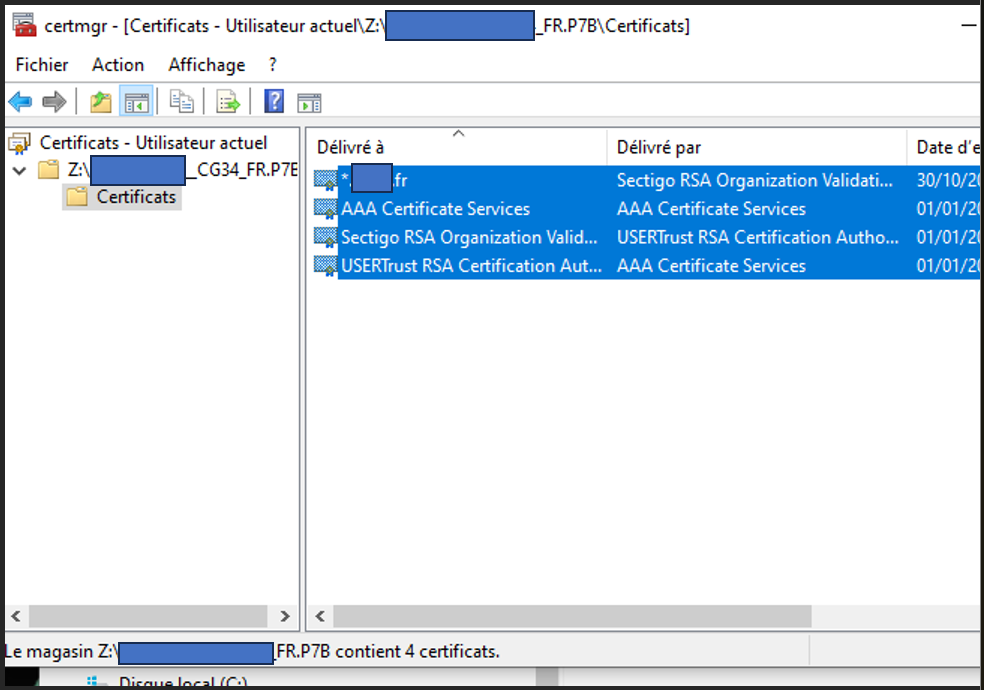
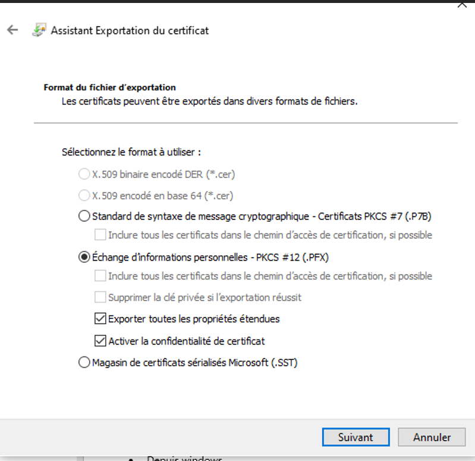
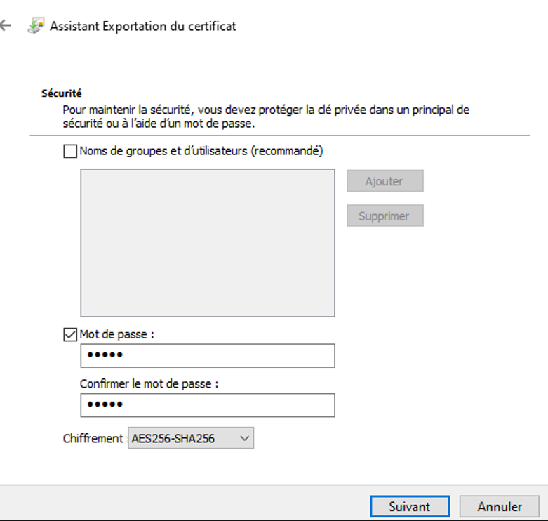
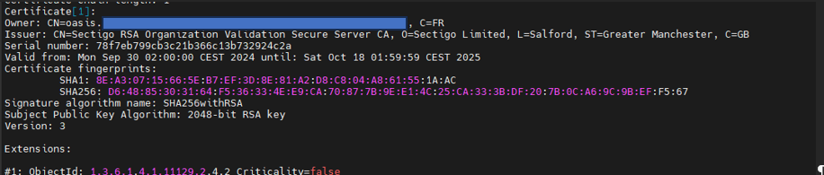

# OpenSSL – Gestion complète des certificats (p7b, crt, chain, key, pfx, CSR, Java, Wildfly)

> ⚠️ Utiliser OpenSSL sur **SRV13**  
> ⚠️ Pour **Windows Server 2012 / IIS 8**, utiliser obligatoirement :  
> `-certpbe PBE-SHA1-3DES -keypbe PBE-SHA1-3DES -nomac`

---

# 1. Extraire un `.crt` depuis un `.p7b`

```bash
openssl pkcs7 -in Z:\CERTIF_SSL\odee.local.fr\odee.local.fr.p7b -inform DER -out Z:\CERTIF_SSL\odee.local.fr\odee.local.fr.crt -print_certs
```

---

# 2. Créer un fichier `.chain`

Créer un fichier texte contenant **tous les certificats sauf le certificat final**, dans **l’ordre du chemin de certification** :

- Root CA  
- Intermediate CA 1  
- Intermediate CA 2  
- …

⚠️ **Uniquement les blocs :**

```
-----BEGIN CERTIFICATE-----
-----END CERTIFICATE-----
```

---

# 3. Vérification de la chaîne

```bash
openssl verify -CAfile Z:\CERTIF_SSL\odee.local.fr\odee.local.fr.chain Z:\CERTIF_SSL\odee.local.fr\odee.local.fr.crt
```

Exemple :

```
Z:\CERTIF_SSL\odee.local.fr\odee.local.fr.crt: OK
```

---

# 4. Générer un `.key` depuis un `.pfx` ou `.p12`

```bash
openssl pkcs12 -in Z:\CERTIF_SSL\odee.local.fr\ssl_eyJpZCI6Njk2OTk0OCwidHlwZSI6IlNTTCJ9.p12 -out Z:\CERTIF_SSL\odee.local.fr\odee.local.fr.key -nodes -nocerts
```

➡️ Entrer le mot de passe du `.p12`

---

# 5. Générer un `.pfx` compatible IIS 2012

```bash
openssl pkcs12 -export -certpbe PBE-SHA1-3DES -keypbe PBE-SHA1-3DES -nomac \
  -inkey hote.local.fr.key \
  -in hote.local.fr.crt \
  -out hote.local.fr.pfx
```

---

# 6. Méthode Windows (alternative)

1. Ouvrir le `.p7b`  
2. Exporter **tous les certificats en Base64**  
3. Construire le `.chain` manuellement  
4. Vérifier :

```bash
openssl verify -CAfile Z:\CERTIF_SSL\laboratoire.local.fr\laboratoire.local.fr.chain Z:\CERTIF_SSL\laboratoire.local.fr\laboratoire.local.fr.cer
```

---

# 7. Générer `.key` depuis `.pfx` / `.p12`

```bash
openssl pkcs12 -in Z:\CERTIF_SSL\laboratoire.local.fr\ssl_eyJpZCI6Njk2OTkzNCwidHlwZSI6IlNTTCJ9.p12 -out Z:\CERTIF_SSL\laboratoire.local.fr\laboratoire.local.fr.key -nodes -nocerts
```

---

# 8. Retirer la passphrase d’un `.key` (pour IIS)

```bash
openssl rsa -in Z:\CERTIF_SSL\laboratoire.local.fr\laboratoire.local.fr.key -out Z:\CERTIF_SSL\laboratoire.local.fr\laboratoire.local.fr.nopass.key
```

---

# 9. Générer un `.pfx` sans mot de passe (IIS)

```bash
openssl pkcs12 -export \
  -in Z:\CERTIF_SSL\laboratoire.local.fr\laboratoire.local.fr.cer \
  -certfile Z:\CERTIF_SSL\laboratoire.local.fr\laboratoire.local.fr.chain \
  -inkey Z:\CERTIF_SSL\laboratoire.local.fr\laboratoire.local.fr.nopass.key \
  -out Z:\CERTIF_SSL\laboratoire.local.fr\laboratoire.local.fr.pfx
```

---

# 10. `.pfx` version 2012 (IIS 8)

```bash
openssl pkcs12 -export -certpbe PBE-SHA1-3DES -keypbe PBE-SHA1-3DES -nomac \
  -inkey hote.local.fr.key \
  -in hote.local.fr.crt \
  -out hote.local.fr.pfx
```

---

# 11. Exemple wildcard

```bash
openssl pkcs12 -export -certpbe PBE-SHA1-3DES -keypbe PBE-SHA1-3DES -nomac \
  -inkey Z:\CERTIF_SSL\.rec.local.fr\rec.local.fr.nopass.key \
  -in Z:\CERTIF_SSL\.rec.local.fr\rec.local.fr.cer \
  -out Z:\CERTIF_SSL\.rec.local.fr\_.rec.local.fr.local.fr_v2012.pfx
```

---

# 12. Extraire un `.crt` depuis `.p7b` (méthode générique)

```bash
openssl pkcs7 -print_certs -in certificat.p7b -out certificat.crt
```

---

# 13. Créer un `.pfx` depuis `.crt` + `.key`

```bash
openssl pkcs12 -export -in certificat.crt -inkey privateKey.key -out output.pfx
```

➡️ Ne rien mettre comme mot de passe pour IIS.

---

# 14. Exemple wildcard local.fr

```bash
openssl pkcs12 -export \
  -in Z:\CERTIF_SSL\wildcard.local.fr\wildcard.local.fr.cer \
  -inkey Z:\CERTIF_SSL\wildcard.local.fr\wildcard.local.fr.decrypted.key \
  -out Z:\CERTIF_SSL\wildcard.local.fr\wildcard.local.fr.pfx
```

---

# 15. Autodiscover

```bash
openssl pkcs12 -export \
  -in Z:\CERTIF_SSL\autodiscover\autodiscover.local.fr.cer \
  -inkey Z:\CERTIF_SSL\autodiscover\autodiscover.local.fr.key \
  -out Z:\CERTIF_SSL\autodiscover\autodiscover.local.fr_CRYPTEDPASS.pfx
```

Version 3DES :

```bash
openssl pkcs12 -export -certpbe PBE-SHA1-3DES -keypbe PBE-SHA1-3DES -nomac \
  -inkey Z:\CERTIF_SSL\autodiscover\autodiscover.local.fr.key \
  -in Z:\CERTIF_SSL\autodiscover\autodiscover.local.fr.cer \
  -out Z:\CERTIF_SSL\autodiscover\autodiscover.local.fr_3DES_PASS.pfx
```

---

# 16. Vérification d’un certificat

```bash
openssl verify -CAfile Z:\CERTIF_SSL\ged-asef\ged-asef.local.fr.chain Z:\CERTIF_SSL\ged-asef\ged-asef.local.fr.cer
```

---

# 17. Vérifier que `.key` et `.crt` correspondent

```bash
openssl rsa -noout -modulus -in votre_fichier.key | openssl md5
openssl x509 -noout -modulus -in votre_fichier.crt | openssl md5
```

➡️ Les deux hash doivent être identiques.

---

# 18. Depuis Windows (certmgr)

⚠️ Si le certificat est sur un **partage réseau**, Windows peut dire *certificat invalide*.

### Solution :

1. Ouvrir :  
   - `certmgr.msc` (certificats utilisateur)  
   - `certlm.msc` (certificats machine locale)

2. Double-cliquer sur le `.pfx`, `.p12`, `.p7b`, `.pem`, `.crt`

3. Aller dans **Personnel → Certificats**

4. Menu **Toutes les tâches → Exporter**




---

# 19. Wildfly – Gestion des certificats

### Dossier de travail

```bash
cd /applis/oasis/TWS_Serveur_W/standalone/configuration/tmp_cert
```

### Depuis Keepass

- Extraire le `.key`  
- Extraire le `.crt`  
- Récupérer le mot de passe dans le `.txt`

### Générer le `.p12`

```bash
openssl pkcs12 -export -out oasis.local.fr.p12 -inkey oasis.local.fr.key -in oasis.local.fr.crt
```

➡️ Entrer le mot de passe du `.txt`  
➡️ Si erreur → utiliser le `.decrypted.key`

### Vérifier le `.p12`

```bash
keytool -v -list -storetype pkcs12 -keystore oasis.local.fr.p12
```


### Déploiement

```bash
cd ..
mv oasis.local.fr.p12 oasis.local.fr.p12_old20AA
mv /applis/oasis/TWS_Serveur_W/standalone/configuration/tmp_cert/oasis.local.fr.p12 /applis/oasis/TWS_Serveur_W/standalone/configuration/oasis.local.fr.p12
```

### Redémarrage Wildfly

```bash
systemctl stop TWSServeurW.service
cd /applis/oasis/TWS_Serveur_W/standalone/tws/bin
./tws-config.sh
systemctl start TWSServeurW.service
```

---

# 20. Authentification Java (trustStore)

Modifier `standalone.xml` :

```bash
JAVA_OPTS="$JAVA_OPTS -Djavax.net.ssl.trustStore=/applis/oasis/TWS_Serveur_W2/java/jdk-21.0.2_linux/lib/security/cacerts"
JAVA_OPTS="$JAVA_OPTS -Djavax.net.ssl.trustStorePassword=changeit"
```

### Mise à jour annuelle du certificat dans Java

```bash
/applis/oasis/TWS_Serveur_W2/java/jdk-21.0.2_linux/bin/keytool \
  -importcert \
  -alias oasis.local.fr \
  -file /tmp/moncert.crt \
  -keystore /applis/oasis/TWS_Serveur_W2/java/jdk-21.0.2_linux/lib/security/cacerts \
  -storepass changeit
```

Modifier aussi `standalone.conf` :

```bash
JAVA_OPTS="$JAVA_OPTS -Djavax.net.ssl.trustStore=/applis/oasis/TWS_Serveur_W2/java/jdk-21.0.2_linux/lib/security/cacerts"
JAVA_OPTS="$JAVA_OPTS -Djavax.net.ssl.trustStorePassword=changeit"
```

---

# 21. CSR simple

```bash
DOMAIN="local.fr"
PASS_FILE="pass_key.${DOMAIN}.txt"
KEY_FILE="${DOMAIN}.key"
DECRYPTED_KEY_FILE="${DOMAIN}.decrypted.key"

openssl rand -base64 32 > "$PASS_FILE"
openssl genrsa -aes256 -passout file:"$PASS_FILE" -out "${DOMAIN}.key" 2048

openssl req -new -key "${DOMAIN}.key" -passin file:"$PASS_FILE" \
  -out "${DOMAIN}.csr" \
  -subj "/C=FR/ST=Region/L=Ville/O=ORGANISME PARTENAIRE/OU=ORGANISME PARTENAIRE/CN=${DOMAIN}/emailAddress=hostmaster@local.fr" \
  -addext "subjectAltName=DNS:${DOMAIN},DNS:local.fr"

openssl rsa -in "$KEY_FILE" -out "$DECRYPTED_KEY_FILE" -passin file:"$PASS_FILE"
```

---

# 22. CSR avec SAN (via fichier de config)

Créer `csr.conf` :

```
[ req ]
default_bits       = 2048
prompt             = no
default_md         = sha256
distinguished_name = dn
req_extensions     = req_ext

[ dn ]
C  = FR
ST = Region
L  = Ville
O  = DSI
OU = LOCAL
CN = *.xxx.local.fr
emailAddress = hostmaster@local.fr

[ req_ext ]
subjectAltName = @alt_names

[ alt_names ]
DNS.1 = *.xxx.local.fr
DNS.2 = xxx.local.fr
```

Script :

```bash
DOMAIN="*.form.local.fr"
PASS_FILE="pass_key.${DOMAIN}.txt"
KEY_FILE="${DOMAIN}.key"
DECRYPTED_KEY_FILE="${DOMAIN}.decrypted.key"

openssl rand -base64 32 > "$PASS_FILE"
openssl genrsa -aes256 -passout file:"$PASS_FILE" -out "$KEY_FILE" 2048
openssl req -new -key "$KEY_FILE" -passin file:"$PASS_FILE" -out "${DOMAIN}.csr" -config csr.conf
openssl rsa -in "$KEY_FILE" -out "$DECRYPTED_KEY_FILE" -passin file:"$PASS_FILE"
```

---

# 23. Certificat JAVA (Linux)

Mettre le certificat dans :

```
/etc/pki/ca-trust/source/anchors/SRV18-CA.crt
```

Puis :

```bash
update-ca-trust
```

---

